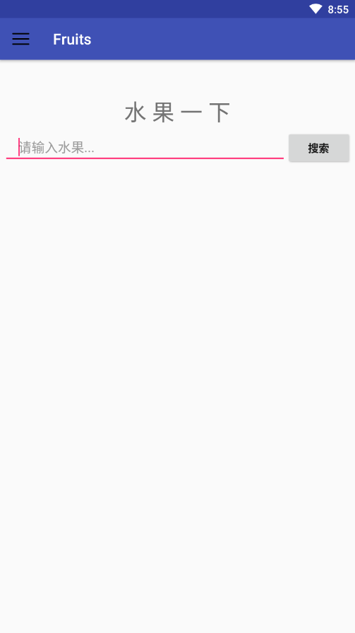
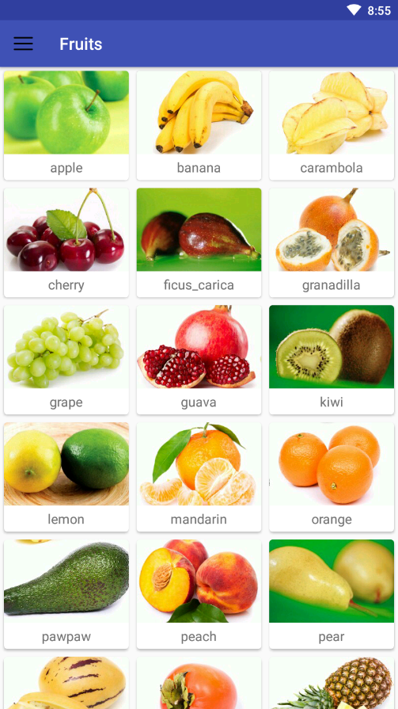
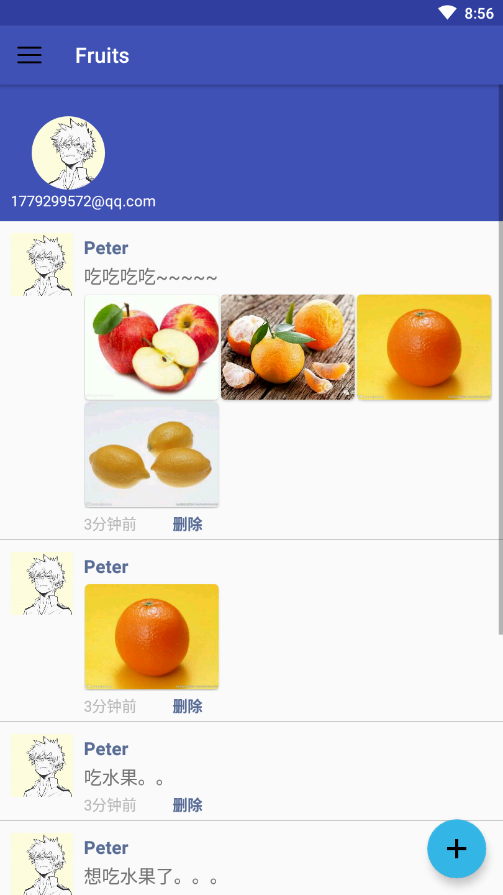
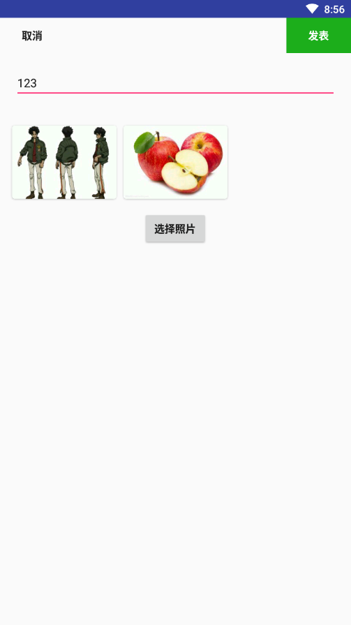
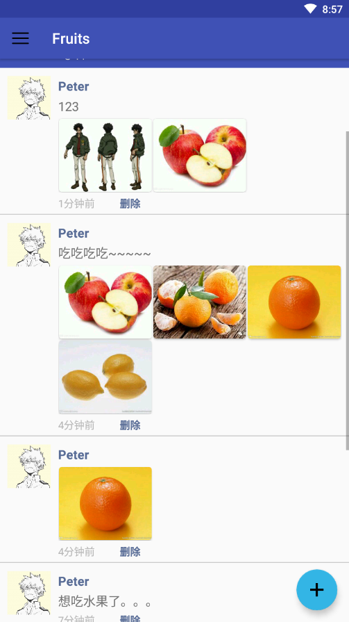

*《Android应用开发》课程项目考核**

**系统说明文档**

- APP名称：Fruits
-  工作量（代码行数/源代码文件数量）：1785
-  系统功能描述

1.  第一个板块是搜索，能够搜索水果的相关信息，资源是来自于百度百科。输入完成，点击搜索后，转跳到另外一个页面，其中显示搜索的相关信息。

2. 第二个板块是广场，能够显示各种水果的图片和英文名称。

3. 第三个板块是我的，可以在其中发表今天吃了什么水果的图片、文字动态。动态里面可以单纯文字或图片。也可以同时有文字和图片。图片可以选择多张。可以查看以前发表过的动态，也可以点击删除按钮后点击确认删除按钮来删除所选择的动态。

 

- 系统运行截图

        
       	
       	
       	
       	
       	
       	
       	
	

